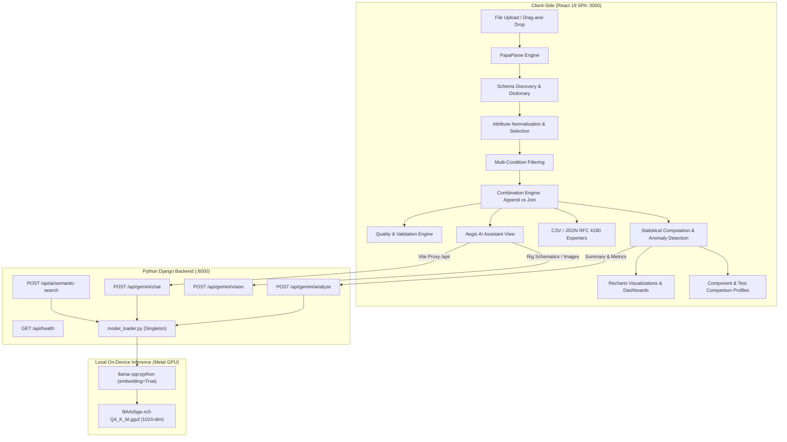

# Comprehensive Technical Analysis: Defence Test Data Analyzer

## 1. Executive Summary

The **Defence Test Data Analyzer** is an enterprise-grade telemetry ingestion, schema alignment, statistical analysis, and AI-assisted diagnostics platform designed for engineering and defence test environments. It provides test engineers with an end-to-end pipeline to import diverse multi-sensor test CSVs (such as turbine vibrations, avionics thermal logs, hydraulic pressures, and electrical load profiles), reconcile heterogeneous schemas, align timestamps, calculate statistical indicators, detect anomalies, compare test runs, and query processed telemetry using a local **Python (Django)** backend running the **BAAI/BGE-M3 GGUF** model for high-dimensional semantic vector retrieval and grounded engineering diagnostics.

---

## 2. Technology Stack Breakdown

### 2.1 Front-End Technologies
| Technology | Version | Purpose & Architectural Role |
| :--- | :--- | :--- |
| **React** | `^19.0.1` | Modern declarative component hierarchy, concurrency features, and functional state hooks (`useState`, `useMemo`, `useEffect`). |
| **React DOM** | `^19.0.1` | DOM renderer mounting root React components. |
| **TypeScript** | `~5.8.2` | Static type safety, strict interface definitions (`UploadedFile`, `CombinedRecord`, `AnomalyItem`, `AttributeStats`), preventing runtime type coercion issues. |
| **Vite** | `^6.2.3` | Next-generation frontend build tool and dev server powering fast HMR and optimized production bundles. |
| **Tailwind CSS** | `^4.1.14` | Utility-first CSS framework via `@tailwindcss/vite`, defining modern clean layout tokens, slate/indigo color palettes, and responsive grids. |
| **Lucide React** | `^0.546.0` | Comprehensive technical iconography library used for navigation, telemetry indicators, status badges, and controls. |
| **Recharts** | `^3.10.1` | Declarative charting library built on React and SVG primitives for time-series telemetry plots and distribution curves. |
| **Framer Motion (`motion`)** | `^12.23.24` | Animation framework for smooth UI transitions and layout effects. |
| **PapaParse** | `^5.6.0` | High-performance in-browser RFC 4180 CSV parser with dynamic typing and chunked parsing capability. |

### 2.2 Back-End Technologies
| Technology | Version | Purpose & Architectural Role |
| :--- | :--- | :--- |
| **Python** | `3.11+` | Core server runtime hosting the analytical and AI model execution layer. |
| **Django** | `^5.2.0` | Production-grade Python web framework managing RESTful telemetry endpoints, CORS policies, and large payload handling (up to 50MB). |
| **django-cors-headers** | `^4.9.0` | Handles Cross-Origin Resource Sharing (CORS) between Django and the Vite/React development server. |
| **llama-cpp-python** | `^0.3.35` | High-performance C/C++ GGUF inference bindings with Apple Silicon Metal GPU acceleration for local vector embeddings. |
| **BGE-M3 (GGUF)** | `Q4_K_M` | State-of-the-art multilingual 1024-dimensional semantic embedding and retrieval model from BAAI, executed locally without cloud dependency. |
| **huggingface_hub** | `^1.24.0` | Automates seamless model discovery and downloading of quantized BGE-M3 GGUF weights. |
| **NumPy** | `^1.26.0` | Vector operations, L2-normalization, and cosine similarity metric calculations for semantic retrieval. |

---

## 3. System Architecture & Workflow



---

## 4. Front-End Architecture & Methodology

The client-side architecture follows a single-page modular pipeline design. State is centralized in `src/App.tsx` and passed downward to dedicated view components corresponding to each phase of the defence test analysis workflow.

### 4.1 Step-by-Step Workflow Pipeline
1. **Dashboard Overview (`DashboardOverview.tsx`)**:
   - Executive telemetry cockpit with high-level KPI cards (files loaded, records parsed, quality score, AI availability).
   - Quick "Load Sample Defence Test Files" launcher.

2. **File Ingestion (`FileUploadView.tsx`)**:
   - Multi-file drag-and-drop or file selector accepting `.csv` and `.txt`.
   - Calls `parseCSVFile` asynchronously, calculating per-file statistics (row count, column count, byte size, missing-value percentage).

3. **Schema Discovery (`SchemaDiscoveryView.tsx`)**:
   - Inspects all uploaded files simultaneously.
   - Groups disparate column headers into a unified attribute dictionary.
   - Detects data types (`number`, `string`, `timestamp`, `boolean`) and physical measurement units.

4. **Attribute Selection (`AttributeSelectionView.tsx`)**:
   - Granular checklist enabling engineers to include or exclude specific measurements from the downstream pipeline.
   - Real-time search filter and bulk Select/Deselect controls.

5. **Data Filtering (`FilteringView.tsx`)**:
   - Rule builder creating boolean filter predicates with operators: `equals`, `not_equals`, `greater_than`, `less_than`, `between`, and `contains`.
   - Real-time enable/disable toggles per filter condition.

6. **Combination & Alignment (`CombinationView.tsx`)**:
   - Configures the integration strategy:
     - **Append (Union)**: Vertical stacking of files.
     - **Join (Align)**: Horizontal alignment by composite keys (`Test_ID` + `Component_ID` + `Timestamp`).
   - Configurable timestamp tolerance windows ($1\text{ ms}$ to $5000\text{ ms}$).
   - Live 50-row preview grid with instant pagination and record metrics.

7. **Data Quality Report (`DataQualityView.tsx`)**:
   - Computes an aggregate Quality Score ($0\text{--}100\%$).
   - Flags matched records, unmatched records, duplicates, timestamp gaps, and inconsistent units.

8. **Telemetry Analysis Dashboard (`AnalysisDashboardView.tsx`)**:
   - Time-series plotting powered by `recharts` (`LineChart`, `ResponsiveContainer`).
   - Summary statistics table covering count, mean, median, min, max, standard deviation, and CV.

9. **Anomaly Detection (`AnomalyDetectionView.tsx`)**:
   - Flags out-of-range sensor readings using statistical algorithms.
   - Categorizes alerts into `Critical`, `High`, `Medium`, and `Low` with severity filters.

10. **Component Profiling (`ComponentProfileView.tsx`)**:
    - Focuses on a single `Component_ID` across all its test executions.
    - Displays component-specific telemetry histories, associated tests, and status indicators.

11. **Test Comparison (`TestComparisonView.tsx`)**:
    - Side-by-side comparative analysis of two test runs (`Test A` vs `Test B`).
    - Differential metrics on average temperatures, vibration loads, and sample volumes.

12. **AI Engineering Assistant (`AIAssistantView.tsx`)**:
    - Interactive chat with "Aegis", an AI Defence Test Data Engineering Analyst.
    - Grounded analysis using telemetry subset context.
    - Integrated browser Text-to-Speech (TTS) via `SpeechSynthesisUtterance`.
    - Multimodal camera/photo upload for test rig inspection and failure analysis.

13. **Export Engine (`ExportView.tsx`)**:
    - Full client-side dataset serialization to CSV (RFC 4180 compliant) and formatted JSON.

---

## 5. Back-End Architecture & API Implementation

The backend is built in **Python (Django 5)** inside the `backend/` directory, orchestrating model loading, REST endpoints, and semantic vector computation:
- **Server Execution**: Runs via `python backend/manage.py runserver 8000`.
- **Vite Integration**: The React frontend (`vite.config.ts`) proxies `/api/*` requests to `http://127.0.0.1:8000`.
- **Model Ingestion**: The `backend/ai_engine/model_loader.py` module manages the `llama_cpp.Llama` singleton, automatically loading `models/bge-m3-Q4_K_M.gguf` with Metal GPU acceleration.

### 5.1 Endpoints Specification

#### `GET /api/health`
- **Purpose**: System and local model health check.
- **Response**: Returns backend framework (`Django 5.x`), AI engine name, status (`ready`), model file existence, and disk size.

#### `POST /api/gemini/analyze`
- **Purpose**: Generates formal engineering reports on dataset summaries, statistical matrices, and detected anomalies.
- **Engine**: BGE-M3 GGUF dense vector ranking.
- **Methodology**: Computes the query embedding, calculates cosine similarity against all anomaly logs and statistical parameters, and synthesizes a traceable markdown analysis citing specific Test IDs and deviations.

#### `POST /api/gemini/chat`
- **Purpose**: Multi-turn conversational interface for querying telemetry.
- **Engine**: BGE-M3 GGUF semantic context search.
- **Methodology**: Embeds user query, ranks contextual telemetry records by semantic similarity, and generates structured technical responses from "Aegis".

#### `POST /api/ai/semantic-search`
- **Purpose**: Direct vector similarity search endpoint.
- **Payload**: `{ query: string, records: any[], textField: string }`.
- **Response**: Telemetry records sorted by cosine similarity score (`_similarity_score`).

#### `POST /api/gemini/vision`
- **Purpose**: Rig schematic and test-stand inspection endpoint.
- **Response**: Registers uploaded imagery and provides engineering inspection guidance correlated with active sensor telemetry.

---

## 6. Core Algorithms & Business Logic

The mathematical and processing logic is consolidated in `src/utils/analyzerUtils.ts`.

### 6.1 CSV Ingestion & Dynamic Header Classification
PapaParse converts raw CSV text into structured objects. During parsing, columns are classified through substring analysis:
- **Timestamps**: Checked against `time`, `date`, `timestamp`.
- **Identifiers**: Checked against `test_id`, `run_id`, `sensor_id`.
- **Components**: Checked against `component_id`, `component`.
- **Units**: Inferred from column naming conventions:
  - `_c`, `temp_c` $\rightarrow$ `°C`
  - `_f`, `temp_f` $\rightarrow$ `°F`
  - `_v`, `voltage` $\rightarrow$ `V`
  - `_a`, `current` $\rightarrow$ `A`
  - `kpa` $\rightarrow$ `kPa`
  - `kw` $\rightarrow$ `kW`
- **Missing Value Percentage**:
  $$\text{Missing } \% = \frac{\sum [v \in \{\text{undefined}, \text{null}, \text{""}, \text{NaN}\}]}{N} \times 100$$

### 6.2 Schema Normalization & Deduplication
To reconcile columns across files where different teams used different headers (e.g., `temp`, `temperature`, `Temperature_C`), the system maps them to canonical attributes:
- `temp*` $\rightarrow$ `Temperature`
- `vib*` $\rightarrow$ `Vibration`
- `volt*` $\rightarrow$ `Voltage`
- `curr*` $\rightarrow$ `Current`
- `press*` $\rightarrow$ `Pressure`
- `flow*` $\rightarrow$ `Flow_Rate`
- `power*` $\rightarrow$ `Power`

### 6.3 Statistical Computation Engine
For each numeric parameter, the system computes standard descriptive statistics:
- **Mean ($\mu$)**:
  $$\mu = \frac{1}{N} \sum_{i=1}^{N} x_i$$
- **Median ($\tilde{x}$)**:
  Middle element or average of two middle elements of sorted array.
- **Variance ($\sigma^2$)**:
  $$\sigma^2 = \frac{1}{N} \sum_{i=1}^{N} (x_i - \mu)^2$$
- **Standard Deviation ($\sigma$)**:
  $$\sigma = \sqrt{\sigma^2}$$
- **Percentiles ($P_{25} = Q_1, P_{75} = Q_3$)**:
  Calculated using index positioning $k = \lfloor N \times 0.25 \rfloor$ and $k = \lfloor N \times 0.75 \rfloor$.
- **Coefficient of Variation ($CV$)**:
  $$CV = \frac{\sigma}{|\mu|} \times 100\%$$

### 6.4 Dual-Method Anomaly Detection
The anomaly engine executes two parallel outlier tests on records ($N \ge 5$):
1. **Z-Score Method (Parametric)**:
   $$z = \frac{|x_i - \mu|}{\sigma}$$
   Flags records where $z > 2.5$.
2. **Interquartile Range Method (IQR / Non-Parametric)**:
   $$IQR = Q_3 - Q_1$$
   $$\text{Lower Bound} = Q_1 - 1.5 \times IQR, \quad \text{Upper Bound} = Q_3 + 1.5 \times IQR$$
   Flags records outside this range.
3. **Severity Classification Matrix**:
   - **Critical**: $z > 4.0$ or $x_i > Q_3 + 3.0 \times IQR$
   - **High**: $z > 3.5$ or $x_i > Q_3 + 2.5 \times IQR$
   - **Medium**: $z > 3.0$
   - **Low**: $z \le 3.0$ (standard threshold outliers)

### 6.5 Record Alignment & Traceability
Each synthesized record in `CombinedRecord` is assigned end-to-end provenance tags:
- `Source_File`: Exact source filename.
- `Source_Row`: Exact source row index.
- `Processing_Time`: Ingestion timestamp.
- `Join_Status`: `'Matched'`, `'Appended'`, or `'SingleSource'`.
- `Data_Quality_Flag`: `'OK'`, `'Warning'`, or `'Anomaly'`.

---

## 7. Data Flow & State Lifecycle

```
[CSV Files / Sample Datasets]
       │
       ▼
[PapaParse Parser] ──────────────────────┐
       │                                 │
       ▼                                 ▼
[UploadedFile Objects]          [Attribute Extraction]
       │                                 │
       │ (User Selection & Filters)      │
       └────────────────┬────────────────┘
                        │
                        ▼
           [Combination Processing]
                        │
             ┌──────────┴──────────┐
             ▼                     ▼
    [CombinedRecord[]]   [DataQualityReport]
             │
             ├──► [Recharts Line Plotting]
             ├──► [Descriptive Statistics Table]
             ├──► [Z-Score & IQR Anomaly Detection]
             ├──► [Component Telemetry Profiles]
             ├──► [Test Comparison Matrix]
             ├──► [RFC 4180 CSV / JSON Export]
             └──► [Gemini 2.5 Flash Telemetry Context]
```

---

## 8. Strengths & Architectural Highlights

1. **Client-Side Privacy & Scale**: Ingestion, schema discovery, data filtering, and statistical metrics run in-browser without shipping multi-gigabyte raw telemetry files across the network.
2. **Deterministic Engineering AI**: Gemini prompts are configured with low temperatures (`0.2`--`0.3`) and strict system constraints to prevent hallucinated measurements.
3. **Traceability by Design**: Every combined cell retains source file and row coordinates, essential for aerospace and defence compliance audits.
4. **Multimodal Engineering Analysis**: Incorporates Gemini 2.5 Flash vision capabilities for inspecting physical test stands, fatigue cracks, and sensor wiring schematics alongside numerical telemetry.
5. **Universal Integration**: Full dual-format export (RFC 4180 CSV and structured JSON) enables direct interoperability with external tools like MATLAB, Python pandas, and lab historians.

---

## 9. Recommendations for Future Enhancements

- **WebWorker Offloading**: For datasets exceeding 100,000 rows, offload `PapaParse` and statistical loops to a Dedicated Web Worker to prevent main-thread UI blocking.
- **Streaming/Parquet Ingestion**: Add support for Apache Arrow / Parquet files to accelerate binary telemetry reads.
- **Dynamic Tolerance Join Interpolation**: Implement linear or cubic spline interpolation between timestamp gaps when aligning asynchronous sensors (e.g., 100Hz vibration vs 1Hz thermocouple).
- **Persistent Storage / Database**: Add SQLite/PostgreSQL telemetry archiving for historical trend analysis across years of test programs.
